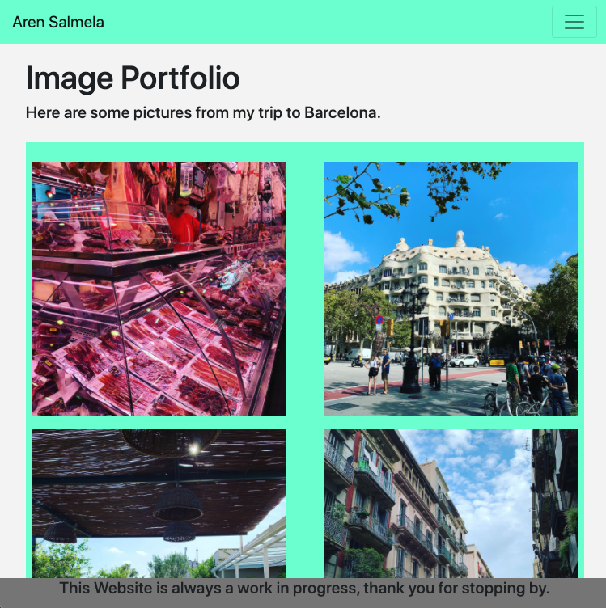

# ResponsivePortfolio

### Collaborated with https://github.com/Ewager1 and https://github.com/ReindeerCode

## Project Link

https://arensalmela.github.io/ResponsivePortfolio/

### Screenshots of website posted down below

### Directions

First, you will use the Bootstrap CSS Framework to create a mobile responsive portfolio. How do you deliver this? Here are some guidelines:

### Create the following files files: index.html, portfolio.html and contact.html.

### Using Bootstrap, develop your portfolio site with the following items:

- A navbar
- A responsive layout
- Responsive images
- The Bootstrap portfolio should minimize the use of media queries.
- Screenshots are provided as a reference in the Assets/Images folder. Your app does not need to be exactly like the images. Use Bootstrap to create a similar, responsive layout.

### Hints

- Use Bootstrap's grid system (containers, rows, and columns).
- On an xs screen, content should take up the entire screen. On sm and larger screens, you should have some margins on the left and right sides of the screen. Check out various sites on your mobile device vs. your computer to see examples of these differences.
- Use an HTML validation service to ensure that each page has valid HTML.

### Minimum Requirements

- Functional, deployed application
- GitHub repository with README describing the project
- Navbar must be consistent on each page.
- Navbar on each page must contain links to Home/About, Contact, and Portfolio pages.
- All links must work.
- Must use semantic html.
- Each page must have valid and correct HTML. (use a validation service)
- Must contain your personalized information. (bio, name, images, links to social media, etc.)
- Must properly utilize Bootstrap components and grid system.

## Screen shots of website

