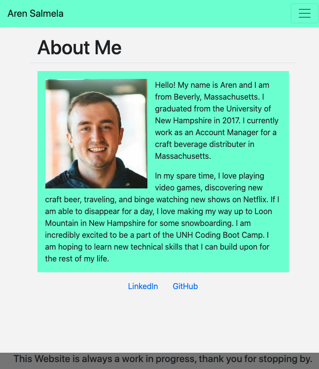

# ResponsivePortfolio

### Collaborated with https://github.com/Ewager1 and https://github.com/ReindeerCode

## Project Link

https://arensalmela.github.io/ResponsivePortfolio/

### Screenshots of website posted down below

### Requirements

- A navbar
- A responsive layout
- Responsive images
- The Bootstrap portfolio should minimize the use of media queries.
- Screenshots are provided as a reference in the Assets/Images folder. Your app does not need to be exactly like the images. Use Bootstrap to create a similar, responsive layout.

### Update Assignment #1

- My first update to my portfolio was fun and challenging. My ultimate goal is to present a minimalistic end product that is easy on the eyes and easy to navigate.
- I consolidated all sections to be on one webpage rather than directing you to a new one when viewing the portfolio for example.
- Created a sticky nav bar to eventually display more unique information within the banner above it.
- Removed portfolio images to display actual projects
- Each project is displayed on a card and has buttons to view deployed site and the Github Repo.
- Added icons for contact websites
- Darker colors are used to be easier on the eyes

## Recent screen shots

## Screen shots of website

